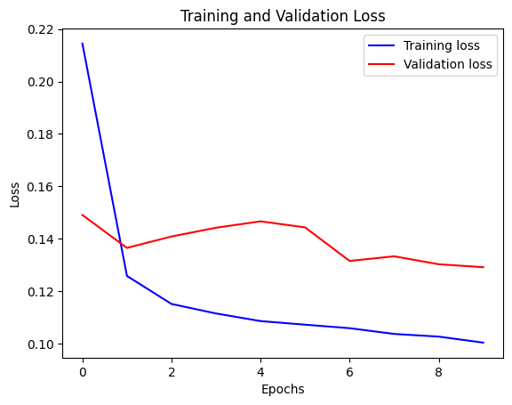
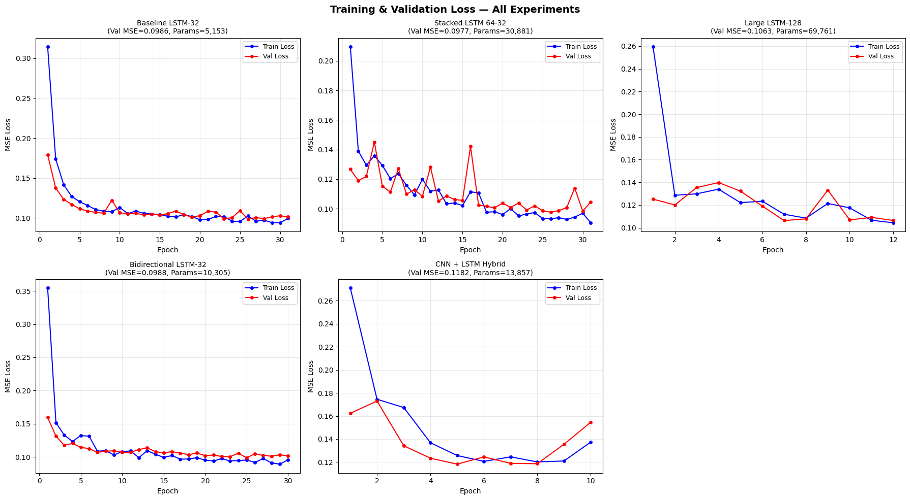
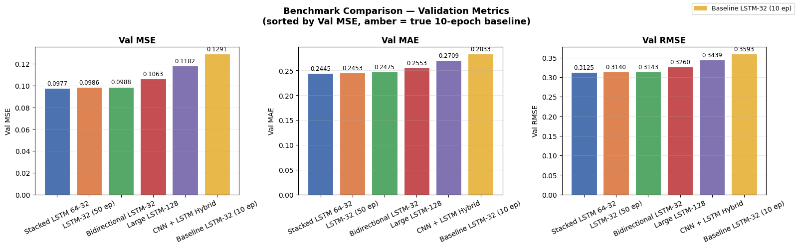
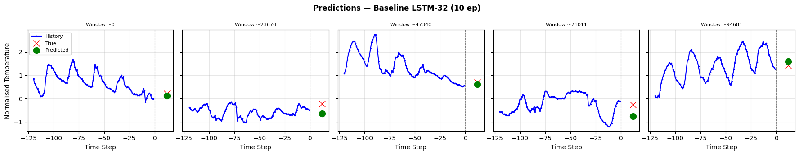
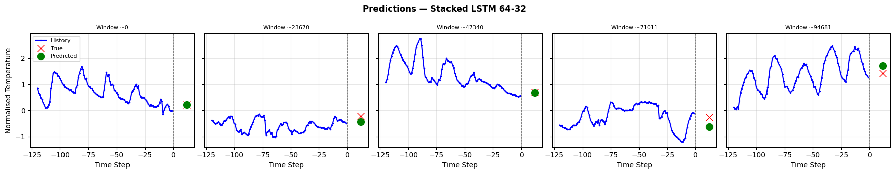

# LSTM and Transformer Tutorials

## Transformer

### Dataset

For this machine learning pipeline, the FordA timeseries dataset was used. This dataset is a collection of measurements of engine noise captured by a motor sensor. The goal of this pipeline is to classify if the engine has an issue. This source contains 3,601 training and 1,320 testing instances.

### Model

A Transformer architecture was chosen for this task because its built-in attention mechanism allows the model to communicate and exchange information efficiently. This allows for more complex data transfer than similar models like an LSTM.

In our pipeline, we treat the 500 timesteps of the engine noise signal as individual tokens. The Transformer analyzes the full sequence to figure out which parts of the noise profile relate to one another, and the model condenses this down into a single prediction: fault or no fault.

### Results

Unfortunately, even though the transformer colab notebook was run as is, the training loop is broken. The model makes no progress and gives up on Epoch 11/150. One theory was that the source of the data was incorrect, but even with altering the link to the data with a known working link, the same problems appeared.

## LSTM

### Dataset

The goal of this task was given the last 5 days of weather history, to predict the air temperature 12 hours into the future. The dataset used was the Jena Climate dataset, which includes 15 features, of which 7 features were selected (atmospheric pressure, temperature, vapor pressure, vapor pressure deficit, specific humidity, air density, and wind speed).

### LSTM model

The Long Short-Term Memory (LSTM)  architecture was chosen for this task. LSTMs are a type of recurrent neural network (RNN) specifically designed to learn long-range dependencies in sequential data. Unlike RNNs, LSTMs use a gating mechanism that controls what information is retained or discarded across timesteps. This makes them particularly well-suited for time series tasks like weather forecasting, where patterns from several days ago may still be relevant to a prediction made today.

In this pipeline, we will feed the LSTM a window of 5 previous days of weather history sampled across 7 meteorological features as its input sequence. The model will then process these features step-by-step while also updating its internal hidden state to carry forward relevant context. Finally, after processing the full input window, the hidden state is then passed through a dense output layer with linear activation. Finally, the output is one single continuous value: the predicted air temperature 12 hours into the future (This is different from our other classification task, as no thresholding technique or softmax is applied. The raw output is our forecast).

### Models

The Keras LSTM time series weather forecasting will serve as our baseline model. Then we will modify the architecture across many experiments and analyze which LSTM has the best results for this task.

#### Baseline

The baseline model, provided by Keras, is an intentionally simple LSTM. The model consists of a single LSTM layer with 32 units followed by a dense output layer, totaling 5,153 parameters. The model ran for a fixed 10 epochs with no early stopping.

The model opened with a high training loss of 0.4515 in epoch 1, which dropped sharply by epoch 2, reflecting the same rapid early learning seen across all experiments. Validation loss improved consistently but unevenly; it stalled between epochs 3 and 6 before resuming improvement, with the best validation loss of 0.1291 recorded at the final epoch 10. Notably, the model was still improving at the point training stopped, suggesting that more epochs would likely have yielded further gains.

#### Experiment

All experiments differed from the baseline in that they had an upper limit of 50 epochs rather than 10, and used a batch size of 2,048 instead of 256.

##### LSTM-32 @ 50 Epochs

The first experiment tested was the easiest to implement. Simply training the baseline LSTM -32 for more epochs. The max epoch was changed from the original baseline of 10 to 50. This allowed us to train the model for longer. The model was trained for 31 epochs before early stopping triggered at 0.0986 validation loss.

##### Stacked LSTM 64-32

This experiment added a second LSTM layer on top of the baseline, creating a two-layer stack of 64 units followed by 32 units, totaling 30,881 parameters. The motivation was that stacking LSTM layers allows the first layer to learn low-level temporal patterns while the second layer learns higher-level abstractions from those patterns. The model was trained for 31 epochs before early stopping was triggered, achieving a best validation loss of approximately 0.0977.

##### LSTM-128

The second experiment kept the single-layer architecture of the baseline but dramatically increased the number of hidden units from 32 to 128, resulting in 69,761 parameters, over 13 times more than the baseline. The thought was that with more parameters, the model had a chance to learn a deeper pattern in the data. Despite this significant increase in capacity, the model was trained for only 12 epochs and achieved a best validation loss of around 0.1063.

##### Bidirectional LSTM

The third experiment replaced the standard LSTM with a Bidirectional LSTM. This architecture runs two LSTM passes over the sequence, one forward and one backward, and concatenates their hidden states, producing a 64-dimensional output from two 32-unit LSTMs, for a total of 10,305 parameters. The idea is that processing the sequence in both directions allows the model to incorporate future context when building a representation of each timestep. The model was trained for 30 epochs and achieved a best validation loss of approximately 0.0988.

##### CNN + LSTM Hybrid

The final experiment took a fundamentally different approach by prepending a convolutional layer to the LSTM. A Conv1D layer with 64 filters first scans the input sequence to extract local features, followed by a MaxPooling layer that halves the sequence length from 120 to 60 timesteps. This compressed, feature-rich representation is then fed into a standard LSTM with 32 units before the final dense output, totaling 13,857 parameters. The intuition is that the CNN handles short-range local pattern detection while the LSTM handles longer-range temporal dependencies. However, the model was trained for only 10 epochs and achieved a final validation loss of approximately 0.1182.

#### Results

Here are the results from the experiments.

| Model | Best Val Loss | Epochs Run |
|---|---|---|
| Stacked LSTM 64-32 | 0.0977 | 31/50 |
| LSTM-32 @ 50 epochs | 0.0986 | 31/50 |
| Bidirectional LSTM-32 | 0.0988 | 30/50 |
| LSTM-128 | 0.1063 | 12/50 |
| CNN + LSTM Hybrid | 0.1182 | 10/50 |
| Baseline (10 ep) | 0.1291 | 10/10 |

Each model's predictions and the true measured temperatures were used to calculate mean squared error (MSE), mean absolute error (MAE), and root mean squared error (RMSE). The bar chart below illustrates how each model performed.

Overall, the validation loss and evaluation metrics indicate that the stacked LSTM was the best-performing model.

However, it is important to note that the other top models (LSTM-32 at 50 epochs, and the bidirectional LSTM) performed very similarly. It is likely that the larger batch size and increased number of epochs contributed to model performance much more than architectural changes. This is demonstrated by the baseline LSTM-32 model, which came within 0.0009 MSE of the top performer after running with larger batch sizes for 31 epochs.

One model that fell short of expectations was the bidirectional LSTM. While the concept of learning context both forwards and backward seems promising on paper, this model performed only as well as the standard forward models. This makes intuitive sense, as weather patterns are likely captured well enough by a forward context and may not require additional backward context.

The weakest results were seen in the CNN + LSTM hybrid and the LSTM-128 models. The intention behind the hybrid model was for the CNN to extract features; however, it is highly likely that there isn't much noise in the inputs for the CNN to filter out. Consequently, the CNN may have discarded useful information that the LSTM needed for accurate predictions. As for the LSTM-128, while it performed adequately, it underperformed relative to its parameter count (achieving a 0.1063 MSE with 69k parameters, compared to a 0.0986 MSE with 5k parameters). This suggests that a 69k parameter count was simply too large for this problem space.

## Additional Questions

### Which model did you find easier to understand and why?

The model I found easiest to understand, LSTM or Transformers, was the LSTM. While the idea of a "hidden state" can be confusing at first, it is easy to understand the overall data flow of each input being fed into a cell, and the cell updates itself and the input. The Transformers query, search, and key mechanism is much more complicated. Ultimately, the sequential nature of the LSTM is easier to grasp.

### What improvement did you try, and what did you learn from it?

For my improvements, I experimented with a couple of architectural changes, stacking LSTM layers, widening the hidden units, adding a bidirectional pass, and throwing a CNN in front of the LSTM. The biggest takeaway was a bit boring that simply training longer with a bigger batch size did more for performance than any of the big architectural tweaks. The stacked LSTM edged out the competition, but by a small margin. I learned that it is usually better to start trying to maximize a simple model before going to a complex one.
